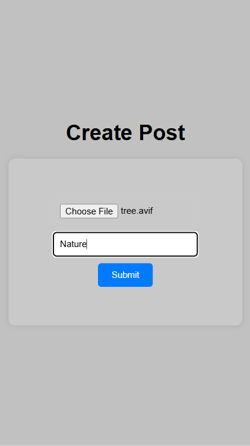
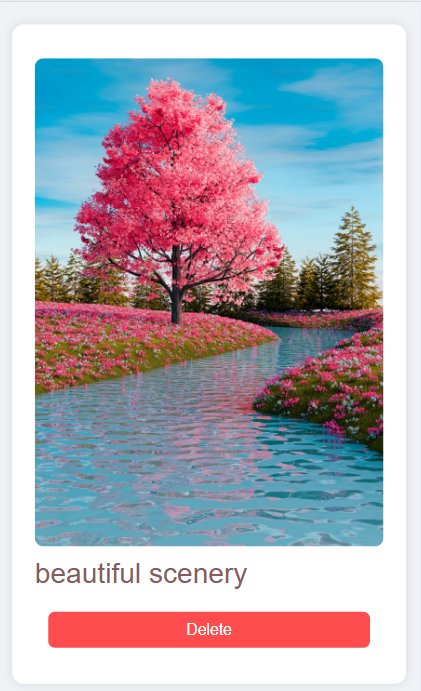
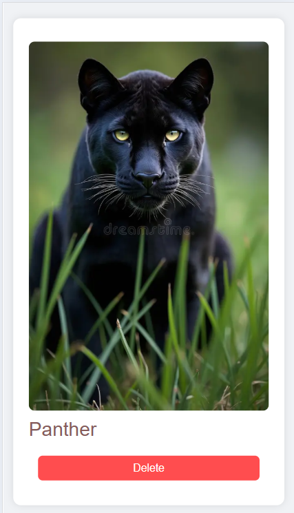
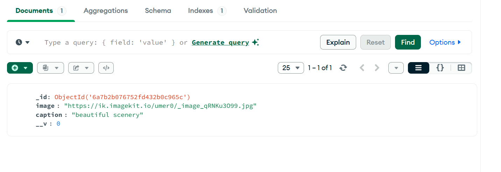

# 📸 Post Feed App

My first simple full-stack social media style application where users can create posts with an image and caption, view them in a scrollable feed, and delete posts. Built with a MERN-based stack and image hosting via ImageKit.

## 📖 Learning

While building this project, I learned and practiced:

- **Full-stack integration** — Connecting a React frontend with an Express + MongoDB backend using REST APIs
- **File uploads** — Handling image uploads using Multer (in-memory storage) and integrating with ImageKit for cloud storage and CDN delivery
- **CORS & environment configuration** — Debugging cross-origin issues and properly configuring `.env` variables (e.g. fixing a bug where the server wasn't listening on the correct port due to a missing fallback value)
- **Error handling** — Adding proper `try/catch` blocks and meaningful HTTP status codes across API routes instead of letting the server crash silently
- **CRUD operations** — Implementing Create, Read, and Delete functionality for posts, and syncing frontend state (`useState`) with backend changes without needing a full page reload
- **Responsive UI design** — Building a mobile-first, scrollable feed layout using Flexbox, `vh` units, and `object-fit` for consistent image sizing across devices
- **Version control** — Managing project structure and commits with Git, including organizing files properly for GitHub to render documentation (e.g., keeping README.md at the project root)


## 🚀 Features

- **Create Post** — Upload an image with a caption
- **Feed View** — Scrollable, Instagram-style feed showing all posts
- **Delete Post** — Remove a post directly from the feed
- **Cloud Image Storage** — Images are uploaded and served via ImageKit
- **Responsive UI** — Optimized for mobile screens with a clean, card-based design

## 🛠️ Tech Stack

**Frontend**
- React
- React Router DOM
- Axios
- CSS (custom, mobile-first)

**Backend**
- Node.js
- Express.js
- Multer (in-memory file handling)
- MongoDB with Mongoose
- ImageKit (image storage & CDN)

## 📂 Project Structure

```
project-root/
├── backend/
│   ├── src/
│   │   ├── app.js
│   │   ├── db/
│   │   │   └── db.js
│   │   ├── models/
│   │   │   └── post.models.js
│   │   └── service/
│   │       └── storage.service.js
│   ├── index.js
│   └── .env
│
└── frontend/
    ├── src/
    │   ├── pages/
    │   │   ├── CreatePost.jsx
    │   │   └── Feed.jsx
    │   ├── App.jsx
    │   └── index.css
    └── package.json
```

## ⚙️ Setup & Installation

### 1. Clone the repository
```bash
git clone <https://github.com/Muhammad-Umer6/Backend_project>
cd project-root
```

### 2. Backend Setup
```bash
cd backend
npm install
```

Create a `.env` file in the backend root:
```env
PORT=3000
MONGODB_URI=your_mongodb_connection_string
IMAGEKIT_PRIVATE_KEY=your_imagekit_private_key
```

Run the backend:
```bash
npm run dev
```

### 3. Frontend Setup
```bash
cd frontend
npm install
npm run dev
```

## 🔌 API Endpoints

| Method | Endpoint          | Description              |
|--------|-------------------|---------------------------|
| POST   | `/create-post`     | Create a new post (image + caption) |
| GET    | `/posts`           | Fetch all posts           |
| DELETE | `/posts/:id`       | Delete a post by ID       |

## 📱 Screenshots

### Create Post Page


### Feed Page


### Feed Page


### Database Page


##  Author

Made by **Muhammad Umer**


